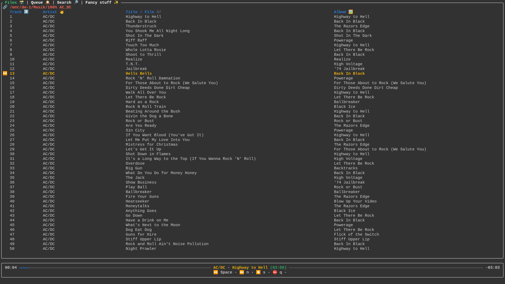
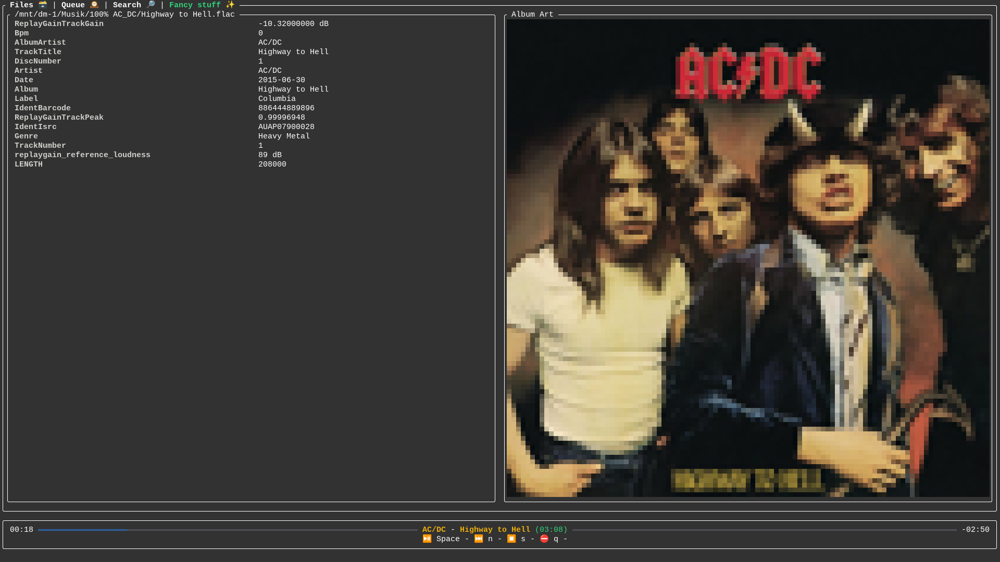

[](https://github.com/Fabus1184/ramp/actions/workflows/rust.yml)

# ramp - rust another music player

Ramp is a no bullshit, batteries included, configurable music player for the terminal. It is designed to be lightweight, customizable and easy to use.

> **Note:** This project is still a work in progress, contributions are welcome.

## Screenshots





## Features

Ramp supports basically all common audio formats thanks to [symphonia](https://crates.io/crates/symphonia).

It also uses caching to store metadata about music files in order to avoid loading times during use.

Other than that, it basically just plays music.

## Installation

`cargo install --path .`

## Configuration

Ramp is configured using a `config.json` file. This file is located in the local configuration directory of your system.


> See `config_dir()` from https://crates.io/crates/dirs

| Platform | Value                             | Example                                  |
| -------- | --------------------------------- | ---------------------------------------- |
| Linux    | $XDG_CONFIG_HOME or $HOME/.config | /home/alice/.config                      |
| macOS    | $HOME/Library/Application Support | /Users/Alice/Library/Application Support |
| Windows  | {FOLDERID_RoamingAppData}         | C:\Users\Alice\AppData\Roaming           |

The default configuration file is generated on first run.

Example configuration:
```json
{
  "search_directories": ["/home/alice/Musik"],
  "extensions": ["mp3", "flac", "ogg", "wav"],
  "cache_path": "/home/alice/.config/ramp/ramp.cache",
  "log_path": "/home/alice/.config/ramp/ramp.log",
  "gain": 0.0
}
```
